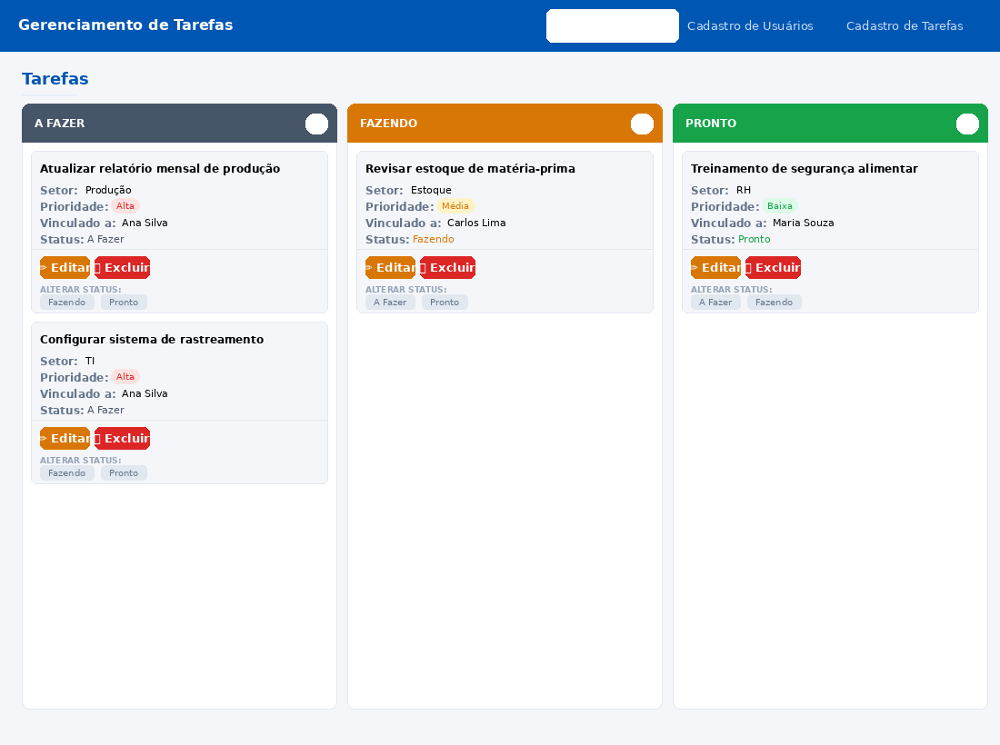
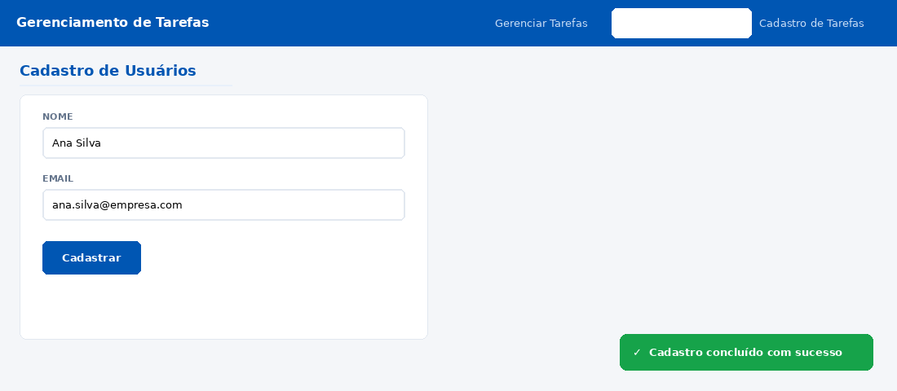
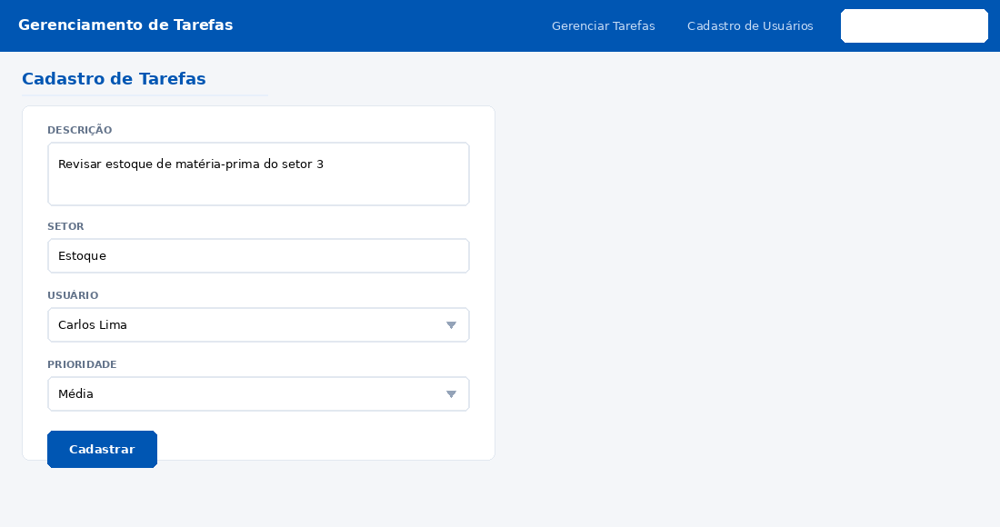
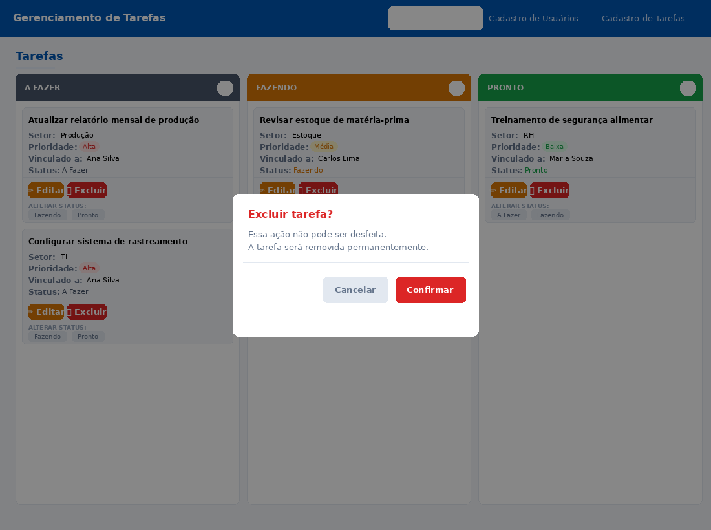

# 📋 Sistema de Gerenciamento de Tarefas — Kanban

> **SAEP 2021 — Técnico em Desenvolvimento de Sistemas**  
> Estudante: **Hítalon Saimon Santos Silva** | SENAI Feira de Santana | Turma G88390

Sistema web de gerenciamento de tarefas no estilo **Kanban / To-Do List**, desenvolvido como entrega da Avaliação Prática de Desempenho (SAEP) para o Curso Técnico em Desenvolvimento de Sistemas.

---

## 📑 Índice

- [Sobre o Projeto](#-sobre-o-projeto)
- [Funcionalidades](#-funcionalidades)
- [Tecnologias Utilizadas](#-tecnologias-utilizadas)
- [Estrutura do Projeto](#-estrutura-do-projeto)
- [Banco de Dados](#-banco-de-dados)
- [Telas do Sistema](#-telas-do-sistema)
  - [Gerenciar Tarefas](#1-gerenciar-tarefas--tela-inicial)
  - [Cadastro de Usuários](#2-cadastro-de-usuários)
  - [Cadastro de Tarefas](#3-cadastro-de-tarefas)
  - [Exclusão com Confirmação](#4-exclusão-com-confirmação)
- [Diagramas](#-diagramas)
- [Como Executar](#-como-executar)
- [Regras de Negócio](#-regras-de-negócio)

---

## 🧩 Sobre o Projeto

Uma indústria do ramo alimentício precisava de uma solução digital para gerenciar tarefas de seus setores, aumentando a visibilidade e integrando informações entre departamentos. O sistema substitui o controle manual por um **board Kanban interativo** com três status:

| Status | Descrição |
|--------|-----------|
| 🔵 **A Fazer** | Tarefas cadastradas e ainda não iniciadas |
| 🟡 **Fazendo** | Tarefas em execução |
| 🟢 **Pronto** | Tarefas concluídas |

---

## ✅ Funcionalidades

- **Cadastro de usuários** com validação de e-mail
- **Cadastro de tarefas** associadas a um usuário, com prioridade e setor
- **Visualização Kanban** em três colunas por status
- **Edição de tarefas** com carregamento automático dos dados
- **Exclusão de tarefas** com modal de confirmação
- **Atualização de status** com movimentação automática entre colunas
- **Campos obrigatórios** em todos os formulários
- **Mensagem de sucesso** após cada cadastro
- **Menu de navegação** acessível em todas as telas

---

## 🛠 Tecnologias Utilizadas

| Camada | Tecnologia |
|--------|-----------|
| **Front-end** | HTML5, CSS3, JavaScript (Vanilla) |
| **Banco de Dados** | MySQL 8+ / MariaDB |
| **Fontes** | Segoe UI |
| **Cores principais** | `#0056b3` (azul), `#FFFFFF` (branco), `#000000` (preto) |

> O arquivo `index.html` é **standalone** — abre diretamente no navegador sem servidor, com dados em memória. Para persistência real, conectar ao backend com o script SQL fornecido.

---

## 📁 Estrutura do Projeto

```
Hitalon_Saimon_Santos_Silva/
│
├── index.html                                          # Aplicação completa (front-end)
│
├── Hitalon_Saimon_Santos_Silva - Criacao_do_banco_de_dados.sql   # Script SQL
│
└── diagramas/
    ├── Hitalon_Saimon_Santos_Silva - Diagrama_ER.jpg             # Diagrama Entidade-Relacionamento
    └── Hitalon_Saimon_Santos_Silva - Diagrama_Caso_de_Uso.jpg    # Diagrama de Caso de Uso
```

---

## 🗃 Banco de Dados

### Modelo de dados

O banco `gerenciamento_tarefas` é composto por **duas tabelas** com relacionamento **1:N**:

```sql
-- Um usuário pode ter muitas tarefas
-- Uma tarefa pertence a apenas um usuário
```

**Tabela `usuarios`**

| Campo | Tipo | Restrição |
|-------|------|-----------|
| `id` | INT AUTO_INCREMENT | PK |
| `nome` | VARCHAR(150) | NOT NULL |
| `email` | VARCHAR(200) | NOT NULL, UNIQUE |

**Tabela `tarefas`**

| Campo | Tipo | Restrição |
|-------|------|-----------|
| `id` | INT AUTO_INCREMENT | PK |
| `id_usuario` | INT | FK → usuarios(id) |
| `descricao` | TEXT | NOT NULL |
| `setor` | VARCHAR(150) | NOT NULL |
| `prioridade` | ENUM('baixa','media','alta') | NOT NULL |
| `data_cadastro` | DATETIME | NOT NULL, DEFAULT NOW() |
| `status` | ENUM('a_fazer','fazendo','pronto') | NOT NULL, DEFAULT 'a_fazer' |

### Como importar o banco

```bash
# 1. Acesse o MySQL
mysql -u root -p

# 2. Execute o script
source Hitalon_Saimon_Santos_Silva\ -\ Criacao_do_banco_de_dados.sql

# Ou via linha de comando:
mysql -u root -p < "Hitalon_Saimon_Santos_Silva - Criacao_do_banco_de_dados.sql"
```

---

## 🖥 Telas do Sistema

### 1. Gerenciar Tarefas — Tela Inicial

A tela principal exibe todas as tarefas organizadas em três colunas, cada uma representando um status. É a primeira tela carregada ao abrir a aplicação.



**Cada card de tarefa exibe:**
- 📝 Descrição da tarefa
- 🏭 Setor responsável
- 🔴🟡🟢 Badge de prioridade (Alta / Média / Baixa)
- 👤 Usuário vinculado
- 📌 Status atual

**Ações disponíveis em cada card:**
- ✏️ **Editar** — redireciona para o formulário com os dados preenchidos
- 🗑️ **Excluir** — abre modal de confirmação antes de remover
- **Alterar status** — botões que movem a tarefa para outra coluna instantaneamente

---

### 2. Cadastro de Usuários

Formulário para registrar novos usuários no sistema. Todos os campos são obrigatórios.



**Campos:**
- **Nome** — texto livre, obrigatório
- **E-mail** — com validação de formato (`usuario@dominio.com`), obrigatório

**Comportamento:**
- Formulário bloqueado se algum campo estiver vazio
- E-mail inválido exibe erro imediato
- Ao cadastrar com sucesso → mensagem `"Cadastro concluído com sucesso"` (toast verde, canto inferior direito)
- Campos limpos automaticamente após o cadastro

---

### 3. Cadastro de Tarefas

Formulário para registrar novas tarefas, associando-as a um usuário já cadastrado.



**Campos:**
- **Descrição** — área de texto, obrigatória
- **Setor** — texto livre, obrigatório
- **Usuário** — dropdown populado dinamicamente com usuários cadastrados
- **Prioridade** — dropdown com as opções: Baixa, Média, Alta

**Comportamento:**
- Status padrão `"a fazer"` é definido automaticamente
- Data de cadastro registrada no momento do envio
- Ao editar uma tarefa existente: campos pré-preenchidos, botão muda para **"Atualizar"**
- Ao salvar edição → tarefa atualizada no board sem criar duplicata

---

### 4. Exclusão com Confirmação

Ao clicar em **Excluir** em qualquer card, um modal de confirmação é exibido sobre a tela, evitando exclusões acidentais.



**Comportamento:**
- Clicar em **"Cancelar"** fecha o modal sem nenhuma ação
- Clicar em **"Confirmar exclusão"** remove a tarefa permanentemente do banco de dados e do board

---

## 📐 Diagramas

### Diagrama Entidade-Relacionamento (DER)

Modelo lógico do banco de dados representando as entidades, atributos e o relacionamento entre `USUARIOS` e `TAREFAS`.


---

### Diagrama de Caso de Uso

Ilustra os atores e as interações com o sistema de gerenciamento de tarefas.


---

## ▶️ Como Executar

### Versão standalone (sem servidor)

```bash
# Basta abrir o arquivo no navegador:
google-chrome index.html
# ou
firefox index.html
# ou simplesmente dar duplo clique no arquivo index.html
```

Os dados são mantidos em memória (JavaScript) durante a sessão. Dados de exemplo já estão pré-carregados.

### Versão com backend (persistência real)

1. Importe o banco de dados:
   ```bash
   mysql -u root -p < "Hitalon_Saimon_Santos_Silva - Criacao_do_banco_de_dados.sql"
   ```

2. Configure um servidor PHP ou Node.js para expor as rotas da API consumindo o banco.

3. Substitua as funções JavaScript de estado (`db`) por chamadas `fetch()` às rotas da API.

---

## 📋 Regras de Negócio

- Um usuário pode cadastrar **uma ou mais tarefas**
- Uma tarefa é cadastrada por **somente um usuário**
- Status padrão de toda nova tarefa: **"a fazer"**
- Todos os campos de cadastro são de **inserção obrigatória**
- O campo e-mail possui **validação de formato**
- Não é necessário controle de acesso (login/sessão/níveis)
- Ao editar uma tarefa, o sistema **não cria uma nova** — apenas atualiza o registro existente
- A exclusão exige **confirmação explícita** do usuário

---

## 👨‍💻 Autor

**Hítalon Saimon Santos Silva**  
Curso Técnico em Desenvolvimento de Sistemas — SENAI Feira de Santana  
Turma: G88390 | Avaliador: Moisés Lima Santos  
SAEP 2021 — Versão do Itinerário Formativo 2021
